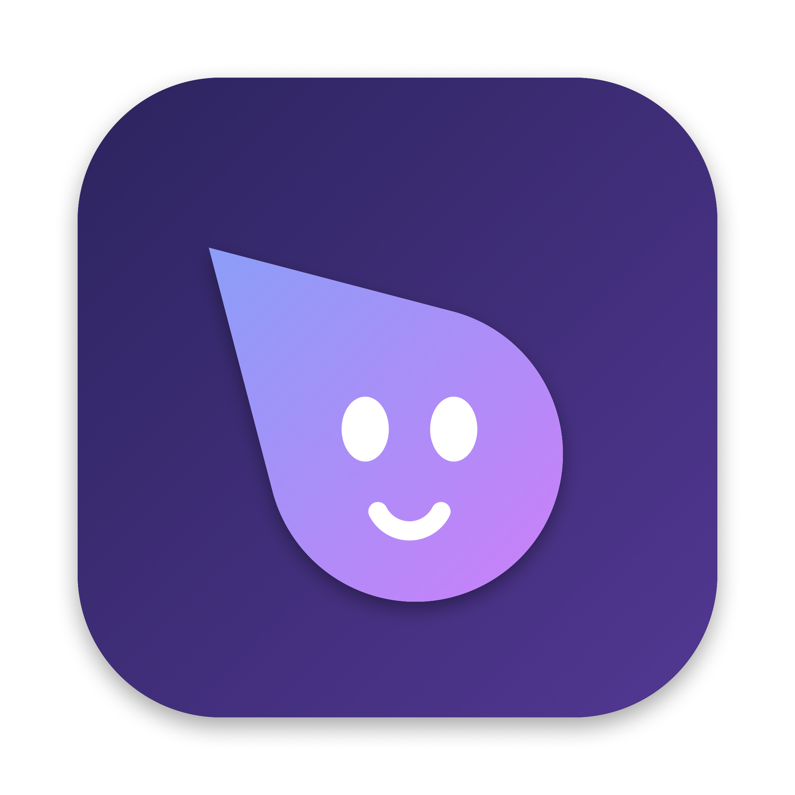

# Sidekick



**An AI buddy for macOS that lives next to your cursor and in the notch.** Hold **⌃⌥** and just talk: Sidekick hears you
with Whisper running on your Mac, looks at your screen, thinks with Google Gemini, answers out loud in a soft, natural
voice, points at exactly where to click — and can do the task for you.

Built in Swift + SwiftUI/AppKit for Apple-silicon Macs. Everything except the Gemini call runs locally.

---

## What it can do

### 🎙️ Talk to your Mac
- **Hold ⌃⌥ and ask anything** — "what's on my screen?", "how do I export this as PDF?", "open github on chrome".
- **Sees your screen** — a screenshot is taken only while you hold the hotkey, kept in memory, never written to disk.
- **Answers out loud** with a natural offline voice (Kokoro "Heart" and 7 other soft voices; a Hindi voice for Hindi replies).
  Talk to it → it talks back. Type to it → it replies in text only.
- **Talks like a friend**, not a robot: warm, short, follows up — and always replies in the language you used
  (English, Hindi or Hinglish).
- **Understands short answers** — "yes", "yeah sure", "haan", "no", "do it" all work, including after it asks
  "want me to…?".
- **Mark the screen** — drag while holding ⌃⌥ to circle the thing you mean.

### 👉 Points, draws and teaches
- A small red cursor follows your pointer (and hides with it while you type). When an answer involves a place on screen
  it **flies there and points**, snapping to the real button via the Accessibility tree. It can also circle, highlight and
  draw arrows.
- **Teaching mode** — "teach me to make a pivot table" runs a step-by-step lesson that waits for you to click the right
  spot, then moves on.

### 🤖 Does things for you (agents)
- Say "open the mac folder", "play lofi on Spotify", "make a CSV of…", "add a meeting tomorrow at 5" — Sidekick runs a
  task in the background and tells you when it's done.
- **Tools**: open apps / folders / files / links **in the app you name** ("on chrome", "in VS Code"), web search (with a
  keyless fallback), read web pages, create files (CSV, XLSX, Markdown), Apple Notes, Calendar, Reminders, shell commands,
  and full **computer use** through Accessibility (read the UI, click, type, press keys, use menus).
- **Safety**: it never types passwords, card numbers or codes; risky shell commands (delete, sudo, …) always ask first;
  everything else can run without prompts if you allow it in Settings. Esc stops a task.
- **Buddies & routines** — named agents with their own folder and memory that run on a schedule
  ("every weekday at 9, summarise my calendar").
- **MCP** — connect Model Context Protocol servers (stdio or HTTP) to give agents more tools.

### 💬 Notch chat
- Hover the notch (or press **⌃⌘A**) for a chat window that grows out of the notch. Resizable, can pop out into a window.
- Markdown with code blocks and tables, readable math (no raw LaTeX), attachments, full-text search, pinned chats.
- **Automatically looks at your screen** when your message is about it ("solve the first question on my screen").
- Live activity in the notch while it listens, thinks, speaks or works; messages appear in full just below the notch.

### ⌨️ Dictation
- Hold **fn⌃** to dictate into any app (double-tap for hands-free). Cleans up filler words, learns from your
  corrections and keeps a personal dictionary.

### 🧠 Memory
- A plain-markdown profile you can read and edit, organised into **About me, Work & projects, Preferences, People,
  Interests & habits**, plus short-term context that expires after a week. It only stores what *you* said — never
  secrets.

### Also
- Skills library (code reviewer, tutor, meeting notes, Hinglish mode, …) that switch on when relevant.
- Quiet mode during calls, screen sharing and Focus; optional morning suggestions; always-on listening (triple-tap ⌃).
- Smart model routing with automatic fallback when a Gemini model is rate-limited or out of free quota.

---

## Shortcuts

| Action | Default |
|---|---|
| Talk (push-to-talk) | hold **⌃⌥** |
| Mark the screen | drag while holding ⌃⌥ |
| Dictate | hold **fn⌃** (double-tap for hands-free) |
| Open / close notch chat | **⌃⌘A** |
| Always-on listening | triple-tap **⌃** |
| Stop / cancel | **Esc** |

All shortcuts can be changed in Settings → Shortcuts.

---

## Getting started

**Requirements:** macOS 14.2+ on Apple silicon, Xcode 16+, `brew install xcodegen`, and a
[Gemini API key](https://aistudio.google.com/apikey) (the free tier works).

```bash
git clone https://github.com/mayank-ydvv/sidekick.git
cd sidekick
./scripts/setup-signing.sh      # one time: stable local signing identity, so permissions survive rebuilds
./build.sh install              # builds a Release app into /Applications (fetches GRDB + the voice engine)
./scripts/fetch-voices.sh       # optional: natural voices (~400 MB)
open /Applications/Sidekick.app
```

On first launch, onboarding asks for **Microphone, Screen Recording, Accessibility and Input Monitoring**, your Gemini key
(stored in the Keychain), and downloads the Whisper model. Calendar & Reminders access can be granted in Settings.

---

## How it works

```
hold ⌃⌥ ─► mic (AVAudioEngine, 16 kHz ring buffer) ──► silence trim ─► Whisper (WhisperKit, on-device)
        └► screenshot (ScreenCaptureKit, in memory) ─┐                          │
                                                     ▼                          ▼
                              Gemini (streaming SSE) ◄── prompt: profile + context + skills + screen
                                     │
              ┌──────────────────────┼─────────────────────────┐
              ▼                      ▼                         ▼
     sentence splitter → voice   [POINT]/[CIRCLE]/[STEP] →   [AGENT] → background agent (Gemini
     (Kokoro via sherpa-onnx)    overlay + AX snapping       function calling + tools + computer use)
```

| Area | Tech |
|---|---|
| UI | SwiftUI + AppKit, Core Animation overlays, a notch panel |
| Speech to text | [WhisperKit](https://github.com/argmaxinc/WhisperKit) (Whisper `small`, on-device) |
| Text to speech | [sherpa-onnx](https://github.com/k2-fsa/sherpa-onnx) + Kokoro / Piper voices, fallback AVSpeechSynthesizer |
| AI | Google Gemini REST API (streaming, thinking levels, function calling, search grounding) |
| Storage | [GRDB](https://github.com/groue/GRDB.swift) (SQLite + FTS5), Keychain, markdown memory files |
| Input | CGEventTap hotkeys, Accessibility (AX) for snapping, typing and computer use |

```
Sidekick/
  App/        app delegate, environment, the voice pipeline (TalkCoordinator), test hooks
  Core/       AI client & prompts, agents & tools, audio, STT, TTS, screen, memory, chat, dictation, MCP, …
  UI/         notch, chat, overlay cursor & annotations, settings, onboarding
  Resources/  prompts, skills, per-app tips
SidekickTests/  190+ unit tests
```

---

## Testing

```bash
./build.sh test        # unit tests
./build.sh uitest      # drives the real UI with synthetic input (dry run: no API calls)
/Applications/Sidekick.app/Contents/MacOS/Sidekick -selfTest YES     # performance self-test
/Applications/Sidekick.app/Contents/MacOS/Sidekick -featureTest YES  # exercises every feature against Gemini
```

### Performance (Release build, M-series MacBook)

| Budget | Measured |
|---|---|
| Whisper `small`, 5 s clip < 700 ms | 336–395 ms |
| Screenshot < 150 ms | 32–84 ms |
| Notch animation 60 fps | 59.6 fps |
| Idle CPU < 3% | 0.04% |
| First spoken word after the reply starts | ≈ 0.4–0.5 s |

---

## Privacy

- Screenshots exist only in memory, and only while you use a hotkey, ask about your screen, or an agent is working.
- Audio is transcribed on your Mac; voices are synthesized on your Mac.
- Chats, memory, notes and settings stay on your Mac. API keys and tokens live in the Keychain.
- Network calls go only to Gemini, the MCP servers you add, and web pages an agent opens for you.

---

## Credits

WhisperKit (MIT) · GRDB (MIT) · sherpa-onnx (Apache-2.0) · Kokoro-82M (Apache-2.0) ·
Piper "priyamvada" voice (CC BY-NC-SA 4.0). The voices are downloaded separately and are not part of this repository.

More detail: [`SPEC.md`](SPEC.md) (the build spec), [`DECISIONS.md`](DECISIONS.md), [`CHANGELOG.md`](CHANGELOG.md).
